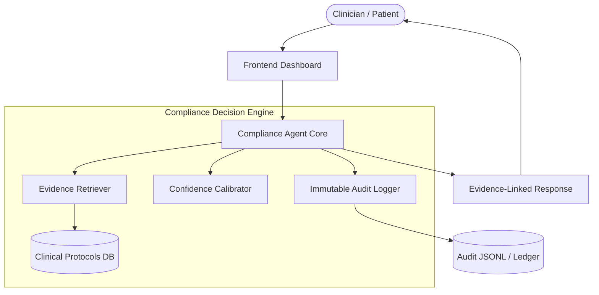
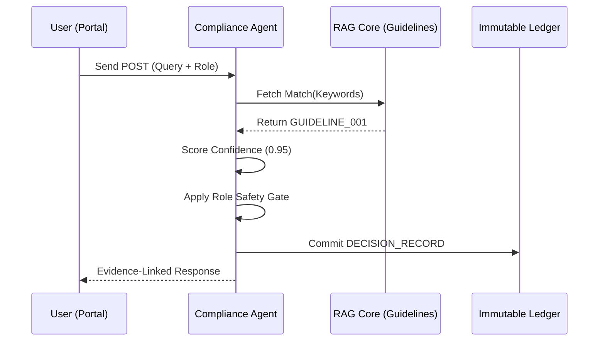

# BINDU Healthcare: Compliance-First Decision Engine 🩺🛡️

[](https://github.com/vilsee)
[](https://github.com/vilsee)

A deep-layer compliance platform built on the **Bindu Internet of Agents** framework. This system ensures that every clinical AI suggestion is strictly grounded in evidence, accurately calibrated for confidence, and recorded in an immutable audit ledger.

---

## 🏗️ System Architecture

Our "Strict Architecture" ensures that AI cannot hallucinate clinical advice without verified evidence.



---

## 🌟 Key Features

### 1. Total AI Traceability
Every recommendation is assigned a unique `audit_id`, linking the query directly to the clinical Guideline (RAG source) used to generate the answer.

### 2. Multi-Role Safety Gating
The engine automatically detects the user's role (Clinician vs. Patient) and applies dynamic data filters and safety disclaimers to prevent medical risk.

### 3. Expanded Clinical Database (9+ Protocols)
Comprehensive decision support for:
- **General Health**: Hypertension, Diabetes, Asthma, Hyperlipidemia.
- **Mental Health**: Depression (MDD), ADHD.
- **Neurodegenerative**: Alzheimer's Disease & Dementia.
- **Neurological**: Multiple Sclerosis (DMT).

### 4. High-Tech Industrial UI
A premium, dark-themed portal with real-time terminal simulation, micro-animations, and glassmorphism transparency.

---

## 🚀 Getting Started

### 📂 Directory Structure
```text
bindu-healthcare/
├── agent/            # Backend Decision Engine (Python)
│   ├── guidelines/   # Clinical Protocol Database
│   ├── logs/         # Immutable Audit Ledger
│   └── agent.py      # Core A2A Handler
└── frontend/         # Multi-Page Dashboard (Vanilla JS/CSS)
    ├── index.html    # System Hub
    ├── protocol.html # Transparency View
    └── demo.html     # Interactive Simulator
```

### 🛠️ Execution

#### 1. Start the Backend Agent
```bash
cd agent
python agent.py
```
*Starts on port 3773. Handles A2A messages.*

#### 2. Launch the Portal
```bash
cd frontend
python -m http.server 8080
```
Visit: **[http://localhost:8080](http://localhost:8080)**

---

## 📡 A2A Interaction Flow

The system communicates via the **A2A (Agent-to-Agent)** protocol:



---

## 📜 Project Documentation
- **[Walkthrough](brain/8078c257-dffa-426b-af50-f5e75007d3ef/walkthrough.md)**: Deep dive into the clinical logic and verification results.
- **[Task Checklist](brain/8078c257-dffa-426b-af50-f5e75007d3ef/task.md)**: Progression tracking and implementation history.

---
© 2026 BINDU HEALTHCARE AGENT. BUILDING THE FUTURE OF COMPLIANT AI.
